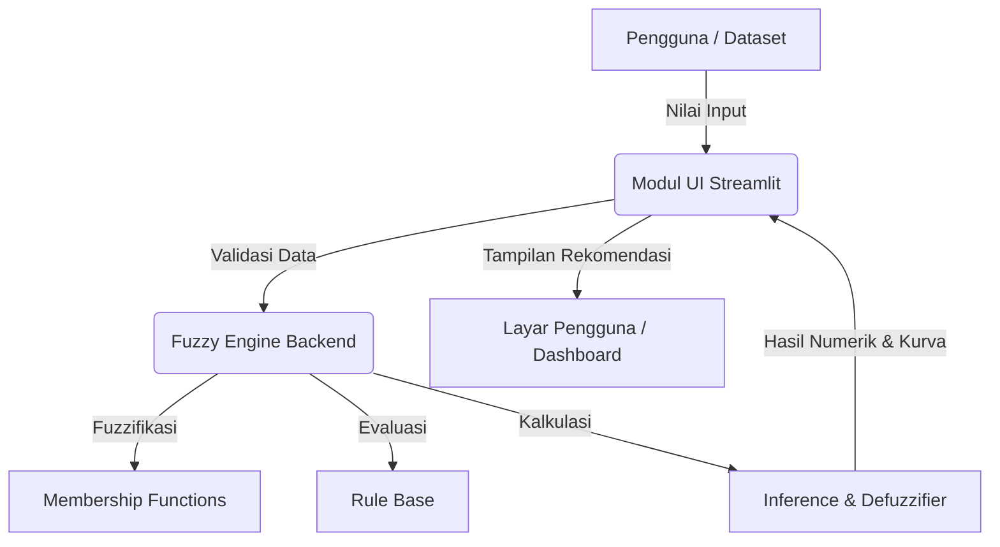

# Praktikum 11 — Fuzzy pada Permasalahan Nyata
## Identifikasi Masalah Domain TI, Analisis Kebutuhan Sistem, dan Perancangan Proposal Produk Fuzzy

---

## A. Tujuan Praktikum
Setelah menyelesaikan praktikum ini, mahasiswa diharapkan mampu:
1. Mengidentifikasi dan memformulasikan masalah nyata di bidang Teknologi Informasi yang memiliki ketidakpastian tinggi.
2. Melakukan analisis kebutuhan fungsional dan non-fungsional untuk aplikasi berbasis logika fuzzy.
3. Menentukan variabel input/output serta menyusun rancangan basis data atau dataset masukan.
4. Menyusun dokumen **Proposal Pengembangan Produk Fuzzy** (*Fuzzy Product Specification*).
5. Merancang arsitektur sistem perangkat lunak yang memisahkan modul inferensi logika fuzzy (*Core Engine*) dengan modul antarmuka pengguna (*User Interface*).

---

## B. Konsep Dasar

### 1. Transformasi Teori Fuzzy Menjadi Produk Perangkat Lunak
Pada Modul 1 dan Modul 2, mahasiswa telah mempelajari komponen teori, penurunan matematis, dan simulasi inferensi. Pada **Modul 3**, fokus pembelajaran bergeser ke **rekayasa produk perangkat lunak** (*Software Product Engineering*):

```text
    TEORI & MODEL                         PRODUK TEKNOLOGI INFORMASI
┌──────────────────────┐                 ┌────────────────────────────────┐
│ • Himpunan Fuzzy     │                 │ • Antarmuka Web (Streamlit)    │
│ • Basis Aturan       │  ────────────►  │ • Dataset / Form Input         │
│ • Mesin Inferensi    │                 │ • Visualisasi & Rekomendasi    │
│ • Defuzzifikasi      │                 │ • Laporan Evaluasi Akurasi     │
└──────────────────────┘                 └────────────────────────────────┘
```

### 2. Bidang Studi Kasus Nyata Teknologi Informasi
Beberapa bidang terapan yang sangat cocok diselesaikan dengan fuzzy:

1. **Sistem Pengelolaan Infrastruktur TI & Cloud:**
   - *Auto-scaling server:* Mengatur penambahan instans server berdasarkan persentase utilisasi CPU dan laju *request per second* (RPS).
   - *Deteksi anomali jaringan:* Menentukan skor ancaman keamanan berdasarkan lonjakan paket data tak dikenal dan kegagalan login.
2. **Sistem Manajemen Layanan Dukungan TI (ITSM):**
   - Penentuan otomatis prioritas tiket penanganan insiden berdasarkan dampak bisnis (*impact*) dan tingkat urgensi (*urgency*).
3. **Sistem Rekomendasi & Personalisasi (Smart Campus / Smart Tourism):**
   - Rekomendasi pemilihan mata kuliah peminatan berdasarkan nilai prasyarat dan minat karier mahasiswa.
   - Rekomendasi paket wisata berdasarkan anggaran, ketersediaan waktu libur, dan preferensi jarak.

---

## C. Analisis Kebutuhan Sistem Fuzzy

Sebuah sistem fuzzy yang baik harus memisahkan spesifikasi teknis menjadi:

### 1. Kebutuhan Fungsional (*Functional Requirements*)
- Sistem harus mampu menerima masukan numerik dari pengguna atau file dataset.
- Sistem harus memvalidasi nilai masukan agar berada dalam batas semesta pembicaraan (*universe of discourse*).
- Mesin fuzzy harus memproses nilai input dan menghasilkan derajat keanggotaan, firing strength, dan nilai crisp output.
- Sistem harus menyajikan interpretasi keputusan dalam bentuk teks deskriptif dan visualisasi grafik yang mudah dipahami orang awam.

### 2. Kebutuhan Non-Fungsional (*Non-Functional Requirements*)
- **Waktu Respon Komputasi:** Proses inferensi harus selesai dalam waktu kurang dari 1 detik.
- **Kemudahan Penggunaan (Usability):** Antarmuka input menggunakan slider numerik atau form yang intuitif dengan panduan nilai.
- **Modularitas Kode:** Kode algoritma fuzzy terisolasi dalam berkas modul terpisah (`fuzzy_engine.py`) agar mudah dipanggil oleh antarmuka web.

---

## D. Format Dokumen Proposal Produk Fuzzy

Mahasiswa menyusun proposal singkat (2-3 halaman format Markdown) dengan susunan:

```markdown
# PROPOSAL PRODUK SISTEM PENDUKUNG KEPUTUSAN FUZZY
## Judul Produk: [Nama Aplikasi yang Menarik]

### 1. Latar Belakang & Problem Statement
- Masalah nyata apa yang ingin diselesaikan?
- Mengapa logika Boolean/aturan kaku gagal menyelesaikan masalah ini secara optimal?
- Siapa target pengguna (stakeholder) dari sistem ini?

### 2. Spesifikasi Variabel Sistem
- Variabel Input 1: [Nama, Satuan, Semesta, Daftar Label Linguistik, Domain]
- Variabel Input 2: [Nama, Satuan, Semesta, Daftar Label Linguistik, Domain]
- Variabel Output: [Nama, Satuan, Semesta, Daftar Label Linguistik, Domain]

### 3. Rancangan Basis Aturan (Rule Base)
- Tabel matriks aturan kombinatorial lengkap.

### 4. Metode Inferensi & Defuzzifikasi yang Dipilih
- Pilihan: Mamdani / Sugeno / Tsukamoto beserta argumentasi ilmiahnya.

### 5. Rencana Arsitektur Perangkat Lunak
- Diagram alur data (Data Flow Diagram / Mermaid flowchart).
- Rencana implementasi UI (Streamlit).
```

---

## E. Diagram Arsitektur Produk (Mermaid)



---

## F. Tugas Praktikum 11

1. Tentukan judul dan tema produk akhir Anda (bisa melanjutkan tugas Modul 1 dan 2).
2. Tulis dokumen proposal lengkap sesuai format Bagian D.
3. Simpan proposal di file: `Modul-3/Proposal_Produk_<NIM>.md`.
4. Siapkan struktur folder proyek aplikasi pada repositori Anda:
   ```text
   Modul-3/
   ├── Proposal_Produk_<NIM>.md
   ├── src/
   │   ├── __init__.py
   │   ├── fuzzy_engine.py       # Logika inferensi fuzzy
   │   └── app.py                # Antarmuka Streamlit (disiapkan untuk Pertemuan 13)
   └── data/
       └── test_cases.csv        # Dataset pengujian (disiapkan untuk Pertemuan 12)
   ```

---

## G. Pertanyaan Analisis

1. Mengapa tahap analisis kebutuhan dan formulasi masalah menjadi penentu terbesar (bobot 15% pada rubrik akhir) keberhasilan sebuah sistem fuzzy?
2. Bagaimana cara menguji apakah variabel input yang kita pilih benar-benar relevan dan independen terhadap variabel output?
3. Apa keuntungan arsitektur modular (`fuzzy_engine.py` terpisah dari `app.py`) dibandingkan menuliskan seluruh kode dalam satu file skrip?

---

## H. Kesimpulan
Pengembangan sistem fuzzy di dunia nyata memerlukan pendekatan rekayasa perangkat lunak yang terstruktur. Melalui proposal produk yang jelas dan arsitektur modular, implementasi logika fuzzy dapat bertransformasi dari sekadar eksperimen teori menjadi solusi teknologi informasi yang bernilai guna dan siap dideploy.
